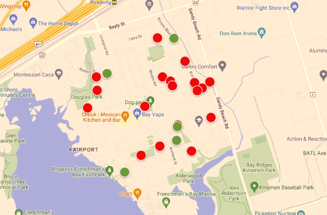

# [**Community Map Project**](https://community-map-207215937730.us-central1.run.app/?communityId=0bf3c0b0-b42d-43a1-b9a1-5e78545c34ea)

## **Overview**

When I first moved into the Bay Ridges area a few years ago, I was delighted to find a flyer advertising the yearly community garage sales event. I was excited, and looked forward to going for a walk on that lovely summer day and get a chance to meet my neighbours. The flyer had a map on it showing where all the garage sales were located. I had my cellphone in one hand, and the paper map in the other hand, and I thought to myself, well, this is stupid, why can’t we have an app that maps out all the garage sales? My neighbour, Jamie, agreed with me, and so we decided to make a website that would allow the organizers to enter in each of the sales and map them out on google maps.

## **Main Objective**

We have successfully managed to reach our goal of having a website that allows the organizers to enter in each of the sales and map them out on google maps. We would like some help from you to get your opinions on workflow and design elements to make this a polished website.

Your help is greatly appreciated.

So please [view the website](https://community-map-207215937730.us-central1.run.app/?communityId=0bf3c0b0-b42d-43a1-b9a1-5e78545c34ea), and let us know what you think, we look forward to hearing your [feedback](mailto:asher@ashergreen.ca).

## **Instructions**

So the way it works, is there is a QR Code on the advertising that visitors can scan and brings them to the map where they can view the mapped out garage sales: 

### The Hamburger Menu

Through this menu you can select garage sales by listing the garage sales in that community and you can select which ones are of interest to you:  

Then when you click on the view selected you will see all the sales that you are interested in:

Or you can click on the “show all sales” and you will have the ones you are interested in, in among all the other ones.

The QR Code option allows you to create a QR Code for that community event in case you meet up with other people at the event so they can get access to the map.

### The Main Page

#### List of Active Community Sales Events

This lists all the community sales events in the app.  You can see which ones are coming up in the future, including the ones for the current day.  Selecting one will take you to the map where the garage sales are mapped out and you can plan your visit.

#### Manage Community Sales

  
If you are planning a sales event, it is here that you can create it.  As you can see by the example, we have three of them here.  It’s pretty easy, after clicking on the button, you just enter in the particulars for the event.  It is advisable to put the major intersection in the "Location" area.

Once you click on the “Manage Garage Sales” button, you can then add, edit and delete garage sales.

## **Future Objectives**

Our next goals are as follows:

* We want to add the ability for the user to add community sales to their calendars (we’ll start with google calendar).

*  We want to create a way for anyone who has a single garage sale to be able to add it to the website, so that all garage sales in a particular area (even within a city) can be mapped out on google maps, allowing people to go from sale to sale throughout the day.

* We want to create a way for users to be able to search for garage sales in a particular area.

*  We want to create a way for users to be able to filter garage sales by date, land location.

*  If there are any other features that you think would be helpful, please let us know.

## **Screenshots**

### **Main Screen**

### **Bay Ridges Community Sales Flyer for 2025**

## **Contact**

Github: GitHub: [@ashergreen82](https://github.com/ashergreen82)

Website: [www.ashergreen.ca](http://www.ashergreen.ca)

Email: [asher@ashergreen.com](mailto:asher@ashergreen.com)
